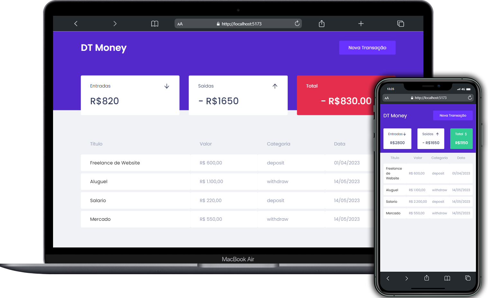

<h1 align='center'>DT Money</h1>
<h2 align='center'>Projeto de controle financeiro criado durante a trilha React do programa Ignite da <a href='https://www.rocketseat.com.br/'>Rocketseat.</a><h2/>

<h1 align='center'>Tecnologias utilizadas</h1>

    
    
    
    
    

